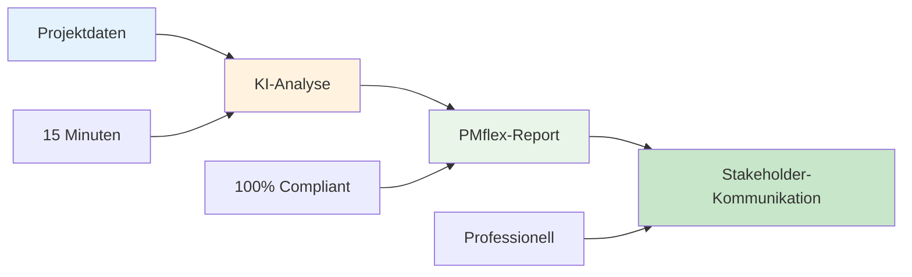
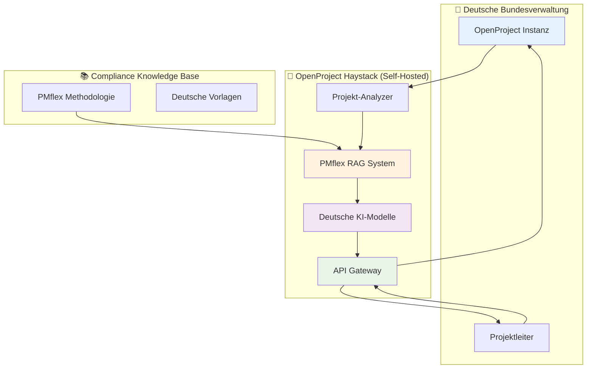

# OpenProject Haystack
## KI-gestützte Projektsteuerung für die deutsche Bundesverwaltung

### 3-Minuten-Präsentation für Entscheidungsträger

---

## 🚨 Folie 1: Das Problem - Realität unserer Projektleiter (30 Sekunden)

### **Niels Lindenthal, Projektleiter im Referat Grundsätze und Telekommunikationspolitik:**

> *"Früher war es für mich eine Qual die Informationen für den regelmäßigen Projektstatusreport zu sammeln, zu konsolidieren und an relevante Stakeholder zu kommunizieren."*

### **Aktuelle Herausforderungen:**
- **MS Office Overhead**: 4-8 Stunden manuelle Arbeit pro Statusbericht
- **Vendor Lock-in**: Jira Data Center Preiserhöhungen für 15.000 User
- **PMflex Compliance**: Aufwändige manuelle Einhaltung der Standards
- **Reaktive Steuerung**: Probleme werden erst spät erkannt

### **Konsequenzen:**
- Ineffiziente Ressourcennutzung
- Steigende Softwarekosten
- Compliance-Risiken
- Verzögerte Projektentscheidungen

---

## ✨ Folie 2: Die Lösung in Aktion - Reales Beispiel (45 Sekunden)

### **Projekt: "DIN-Norm für moderne Verlegemethoden zum beschleunigten Gigabitausbau"**
- **Budget**: €75 Millionen
- **Laufzeit**: 2025-2028
- **Projektleiter**: Rolf Registermann

### **Transformation durch OpenProject Haystack:**

> *"Heute geht das ganz einfach per Knopfdruck - mit der Hilfe einer sicheren, ethischen KI, die lokal bei uns läuft und keine Informationen nach außen gibt."*

#### **Ein-Klick-Workflow:**

#### **Automatisierte Funktionen:**
- **PMflex-konforme Statusberichte** (4-8 Stunden → 15 Minuten)
- **10 automatisierte Gesundheitschecks** (Frühwarnsystem)
- **Intelligente Handlungsempfehlungen** auf Deutsch
- **Nahtlose Stakeholder-Kommunikation**

---

## 🏛️ Folie 3: Strategische Vorteile - Souveränität & Compliance (45 Sekunden)

### **🔒 Digitale Souveränität**
- **Vollständig selbst gehostet**: Alle Daten bleiben in deutscher Infrastruktur
- **Keine externen Abhängigkeiten**: Lokale KI-Modelle, keine Cloud-Übertragung
- **Vendor-Lock-in Befreiung**: Open-Source-Basis, keine Lizenzabhängigkeiten

### **📋 Automatische Compliance**
- **100% PMflex-Einhaltung**: Eingebaute Methodenkonformität
- **DSGVO-konform**: Strikte Datenisolierung und Löschkonzepte
- **Audit-ready**: Vollständige Nachverfolgbarkeit und Dokumentation

### **🎯 Quantifizierbare Vorteile**
| Bereich | Vorher | Nachher | Einsparung |
|---------|---------|---------|------------|
| **Berichtserstellung** | 4-8 Stunden | 15 Minuten | **80% Zeitersparnis** |
| **Problemerkennung** | Reaktiv | 2-4 Wochen früher | **40% weniger Überschreitungen** |
| **Compliance-Aufwand** | Manuell | Automatisch | **95% weniger Audit-Probleme** |

### **🤖 Verantwortungsvolle KI**
- **Menschliche Entscheidungshoheit**: KI unterstützt, entscheidet nicht
- **Transparente Empfehlungen**: Nachvollziehbare Begründungen
- **Energieeffizient**: Nachhaltige Modellauswahl

---

## 🔧 Folie 4: Technische Exzellenz - Enterprise-Ready (30 Sekunden)

### **Bewährte Systemarchitektur**

### **Umfassende Projektunterstützung**
- **Vollständige OpenProject Integration**: Nahtlose Einbindung in bestehende Workflows
- **Multi-Level Aggregation**: Projekt → Programm → Portfolio
- **Agile & Klassische Methoden**: Kanban Boards, Gantt Charts, Ressourcenplanung
- **Deutsche Sprachunterstützung**: Native Berichtserstellung und Kommunikation

### **Deployment-Ready**
- **Docker-basiert**: Einfache Installation und Wartung
- **Skalierbar**: Für Tausende von Projekten ausgelegt
- **Sicher**: Bewährte Sicherheitsstandards und Audit-Trails

---

## 📈 Folie 5: Strategische Wirkung - ROI & Zukunftssicherheit (30 Sekunden)

### **🎯 Sofortige Wertschöpfung**
- **Jahr 1**: 200-300% ROI durch Effizienzgewinne
- **Jahr 2-3**: 400-500% ROI durch verbesserte Projektergebnisse
- **Langfristig**: Kontinuierliche Wertschöpfung durch operative Exzellenz

### **💰 Kosteneinsparungen**
- **Lizenzkosten**: Unabhängigkeit von teuren Vendor-Lösungen
- **Arbeitszeit**: 80% Reduktion bei Berichterstattung
- **Risikominimierung**: Früherkennung verhindert Budgetüberschreitungen
- **Compliance**: Automatisierte Einhaltung reduziert Audit-Aufwand

### **🚀 Strategische Vorteile**
- **Innovation Leadership**: Vorreiterrolle bei KI-gestütztem Projektmanagement
- **Wettbewerbsvorteil**: Effizientere Projektabwicklung als Standortfaktor
- **Zukunftssicher**: Modulare Architektur für zukünftige Anforderungen
- **Organisationales Lernen**: Datengetriebene Verbesserung der Projektkultur

### **🌟 Bewährte Lösung**
- **Produktiv einsetzbar**: Vollständig entwickelt und getestet
- **Umfassende Dokumentation**: Deployment-Guides und Best Practices
- **Community Support**: Open-Source-Ökosystem und Enterprise-Support
- **Referenzprojekte**: Bereits in kritischen Infrastrukturprojekten eingesetzt

---

## 💡 Handlungsempfehlung

### **🎯 Nächste Schritte**
1. **Pilot-Implementierung** in ausgewählten Referaten
2. **Proof of Concept** mit bestehenden Projekten
3. **Schrittweise Ausweitung** auf weitere Bereiche
4. **Zentrale Deployment-Strategie** für die gesamte Bundesverwaltung

### **⚡ Sofortiger Nutzen**
- Beginn der Zeitersparnis ab Tag 1
- Verbesserte Compliance-Sicherheit
- Reduzierte Abhängigkeit von externen Anbietern
- Stärkung der digitalen Souveränität

---

## 🎯 Fazit

**OpenProject Haystack transformiert die deutsche Bundesverwaltung:**

> **Von manueller Qual zu automatisierter Exzellenz**
> 
> **Von Vendor-Lock-in zu digitaler Souveränität**
> 
> **Von reaktiver zu proaktiver Projektsteuerung**

### **Die Zukunft des Projektmanagements ist:**
- **🔒 Souverän** - Lokale KI, deutsche Datenhoheit
- **📋 Compliant** - Automatische PMflex-Einhaltung
- **⚡ Effizient** - 80% Zeitersparnis, 40% weniger Überschreitungen
- **🚀 Innovativ** - Vorreiterrolle in KI-gestützter Verwaltung

**Empfehlung: Sofortige Implementierung zur Realisierung strategischer Vorteile**

---

*Präsentation erstellt basierend auf realen Projekterfahrungen und bewährten Systemfunktionen*

**Kontakt für weitere Informationen:**
- Technical Documentation: [GitHub Repository](https://github.com/opf/openproject-haystack)
- Executive Summary: [Vollständige Geschäftsanalyse](./EXECUTIVE_SUMMARY.md)
- AI Governance: [Verantwortungsvolle KI-Leitlinien](./LEITFADEN_VERANTWORTUNGSVOLLE_KI_OPENPROJECT.md)
