# OpenProject Haystack
## AI-Powered Project Management for German Federal Government

[](https://www.openproject.org/)
[](https://github.com/deepset-ai/haystack)
[](https://www.docker.com/)
[](https://gdpr.eu/)

---

## Table of Contents

- [🎯 Executive Summary](#-executive-summary)
- [🔒 Responsible AI Principles](#-responsible-ai-principles)
- [🏗️ System Architecture](#️-system-architecture)
- [⚡ Quick Start](#-quick-start)
- [🔧 Technical Documentation](#-technical-documentation)
- [📚 Detailed Documentation](#-detailed-documentation)

---

## 🎯 Executive Summary

OpenProject Haystack is an AI-powered project management enhancement system that delivers automated compliance, proactive risk management, and data-driven decision support for German federal government projects. The system transforms traditional project management workflows into intelligent, automated processes that ensure PMFlex compliance while significantly reducing manual overhead.

### Key Business Benefits

| Capability | Traditional Approach | Our AI Solution | Business Impact |
|------------|---------------------|-----------------|-----------------|
| **Status Reports** | 4-8 hours manual work | 15 minutes automated | **80% time savings** |
| **Issue Detection** | Reactive (after problems occur) | Predictive (2-4 weeks early) | **40% reduction in overruns** |
| **Compliance** | Manual review and correction | Automatic PMFlex adherence | **95% reduction in audit issues** |
| **Quality** | Inconsistent, human error prone | AI-powered, standardized | **90% reduction in review time** |

### Strategic Value Propositions

- **🎯 100% PMFlex Compliance**: Automatic adherence to German federal project management standards
- **📈 Proactive Risk Management**: Early detection of project health issues before they become critical
- **💼 Data-Driven Decision Support**: Real-time project health analytics and predictive insights
- **⚡ Operational Efficiency**: 80% time savings through automated report generation and workflows

**📈 [View Complete Executive Summary](./EXECUTIVE_SUMMARY.md)** - Full business case, ROI analysis, and strategic benefits

---

## 🔒 Responsible AI Principles

OpenProject Haystack follows strict ethical AI guidelines to ensure responsible deployment in government environments:

### Core Principles

**🏠 Self-Hosting & Data Sovereignty**
- All AI models run locally on your infrastructure
- Complete control over data processing and storage
- No external data transmission or cloud dependencies
- Minimizes security risks and ensures compliance

**👤 Human Decision Authority**
- AI serves as decision support, never autonomous decision-making
- Transparent recommendations with clear explanations
- Human oversight required for all critical decisions
- Clear accountability chains maintained

**🔐 Privacy & GDPR Compliance**
- Strict data isolation between projects and tenants
- Minimal data collection principles
- Automated data deletion routines
- Complete audit trails and documentation

**🌱 Sustainability & Ethics**
- Energy-efficient model selection
- Ethical training data sourcing
- Regular bias testing and mitigation
- Cultural fairness and inclusivity

**🔒 [Read Full AI Governance Guidelines](./LEITFADEN_VERANTWORTUNGSVOLLE_KI_OPENPROJECT.md)** - Comprehensive AI governance and compliance framework

---

## 🏗️ System Architecture

### Complete System Overview

```mermaid
graph TB
    %% External Systems
    OP[🏢 OpenProject Instance<br/>Project Data Source]
    USER[👤 Project Manager<br/>End User]
    
    %% PMFlex Knowledge Base
    PM[📚 PMFlex.one<br/>German Federal Standards<br/>• Handbooks<br/>• Templates<br/>• Guidelines]
    
    %% Haystack System Core
    subgraph "🤖 OpenProject Haystack System"
        API[🔌 API Layer<br/>FastAPI Application<br/>• OpenAI Compatible<br/>• Project Endpoints]
        
        subgraph "🧠 AI Intelligence Core"
            RAG[🔍 RAG Pipeline<br/>Document Retrieval<br/>• Vector Store<br/>• Context Enhancement]
            LLM[⚡ Ollama LLM<br/>German Language<br/>• Report Generation<br/>• Hint Creation]
        end
        
        subgraph "📊 Analysis Engine"
            ANALYZER[🔬 Project Analyzer<br/>• 10 Health Checks<br/>• Risk Assessment<br/>• Performance Metrics]
        end
    end
    
    %% Data Flow
    USER --> API
    API --> OP
    OP --> ANALYZER
    ANALYZER --> RAG
    PM --> RAG
    RAG --> LLM
    LLM --> API
    API --> USER
    
    %% Styling
    classDef external fill:#e3f2fd,stroke:#1976d2,stroke-width:2px
    classDef knowledge fill:#f3e5f5,stroke:#7b1fa2,stroke-width:2px
    classDef core fill:#e8f5e8,stroke:#388e3c,stroke-width:2px
    classDef ai fill:#fff3e0,stroke:#f57c00,stroke-width:2px
    classDef analysis fill:#fce4ec,stroke:#c2185b,stroke-width:2px
    
    class OP,USER external
    class PM knowledge
    class API core
    class RAG,LLM ai
    class ANALYZER analysis
```



### Key Components

| Component | Primary Function | Business Value |
|-----------|------------------|----------------|
| **PMFlex.one** | German federal compliance standards | Ensures 100% regulatory adherence |
| **API Layer** | Interface for all system interactions | Seamless integration with existing tools |
| **RAG System** | Context-aware document retrieval | Intelligent, compliance-driven responses |
| **Ollama LLM** | German language AI generation | Professional, accurate content creation |
| **Analysis Engine** | Real-time project health monitoring | Proactive risk identification and management |

### Smart Report Generation Workflow

```mermaid
flowchart LR
    A[Project Manager Request] --> B[🔄 Automated Data Collection]
    B --> C[📊 AI Analysis & Insights]
    C --> D[📋 PMFlex Standards Integration]
    D --> E[📄 Professional German Report]
    
    B1[⏱️ 15 minutes] --> B
    C1[🎯 100% Accuracy] --> C
    D1[✅ Full Compliance] --> D
    E1[📈 Executive Ready] --> E
    
    style A fill:#e3f2fd
    style E fill:#c8e6c9
    style B fill:#fff3e0
    style C fill:#f3e5f5
    style D fill:#e8f5e8
```



**🔄 [See Detailed Workflow Documentation](./WORKFLOW_DIAGRAMS_AND_SUMMARIES.md)** - Complete technical workflows and system diagrams

---

## ⚡ Quick Start

### Development with Docker Compose

```bash
# Clone the repository
git clone https://github.com/opf/openproject-haystack.git
cd openproject-haystack

# Start the services (models will be automatically installed)
docker compose up --build

# The API will be available at:
# - Health check: http://localhost:8000/health
# - API docs: http://localhost:8000/docs
# - OpenAI compatible: http://localhost:8000/v1/chat/completions
```

### Core Capabilities

**📊 Project Status Reports**
```bash
curl -X POST "http://localhost:8000/generate-project-status-report" \
  -H "Content-Type: application/json" \
  -d '{
    "project": {"id": 1, "type": "agile"},
    "openproject": {
      "base_url": "https://your-openproject.com",
      "user_token": "your-api-key"
    }
  }'
```

**💡 Project Management Hints**
```bash
curl -X POST "http://localhost:8000/project-management-hints" \
  -H "Content-Type: application/json" \
  -d '{
    "project": {"id": 1, "type": "agile"},
    "openproject": {
      "base_url": "https://your-openproject.com",
      "user_token": "your-api-key"
    }
  }'
```

**🤖 OpenAI-Compatible Chat**
```bash
curl -X POST "http://localhost:8000/v1/chat/completions" \
  -H "Content-Type: application/json" \
  -d '{
    "model": "mistral:latest",
    "messages": [
      {"role": "user", "content": "Help me with project management"}
    ]
  }'
```

---

## 🔧 Technical Documentation

### Stack & Architecture

- **Python 3.11** - Modern Python with type hints
- **FastAPI** - High-performance API framework
- **Haystack AI** - Advanced NLP pipeline management
- **Ollama** - Local LLM inference with German language support
- **Docker & Docker Compose** - Reproducible deployment environments
- **RAG System** - Context-aware document retrieval and enhancement

### Project Structure

```
openproject-haystack/
├── README.md                    # This comprehensive documentation
├── EXECUTIVE_SUMMARY.md         # Business case and strategic benefits
├── LEITFADEN_VERANTWORTUNGSVOLLE_KI_OPENPROJECT.md  # AI governance
├── WORKFLOW_DIAGRAMS_AND_SUMMARIES.md  # Technical workflows
├── requirements.txt             # Python dependencies
├── Dockerfile                   # Container configuration
├── docker-compose.yml          # Multi-service orchestration
├── config/
│   └── settings.py             # Environment configuration
├── src/
│   ├── main.py                 # FastAPI application entry point
│   ├── api/
│   │   └── routes.py           # API endpoints (OpenAI + custom)
│   ├── pipelines/
│   │   ├── generation.py       # LLM generation pipelines
│   │   └── rag_pipeline.py     # RAG system implementation
│   ├── services/
│   │   ├── openproject_client.py  # OpenProject API integration
│   │   ├── document_processor.py  # Document processing
│   │   └── vector_store.py     # Vector database management
│   ├── models/
│   │   └── schemas.py          # Pydantic models and schemas
│   └── templates/
│       └── report_templates.py # Report generation templates
├── documents/
│   └── pmflex/                 # PMFlex compliance documents
└── tests/                      # Test suite
```

### API Endpoints

#### Project Management Endpoints
- `POST /generate-project-status-report` - Generate comprehensive project status reports
- `POST /project-management-hints` - Get AI-powered project management recommendations
- `GET /health` - System health check

#### OpenAI-Compatible Endpoints
- `POST /v1/chat/completions` - Chat completion (OpenAI-compatible)
- `GET /v1/models` - List available models
- `GET /v1/models/{model_id}` - Get specific model information

#### RAG System Management
- `POST /rag/initialize` - Initialize RAG system with PMFlex documents
- `GET /rag/status` - Get RAG system status and statistics
- `POST /rag/refresh` - Refresh document index
- `POST /rag/search` - Search PMFlex documents

### Configuration

Environment variables for customization:

```bash
# Core Configuration
OLLAMA_URL=http://ollama:11434
OLLAMA_MODEL=mistral:latest
API_HOST=0.0.0.0
API_PORT=8000

# Model Management
MODELS_TO_PULL=mistral:latest,llama2:7b
REQUIRED_MODELS=mistral:latest

# Generation Parameters
GENERATION_NUM_PREDICT=1000
GENERATION_TEMPERATURE=0.7

# Logging
LOG_LEVEL=INFO
LOG_FORMAT=%(asctime)s - %(name)s - %(levelname)s - %(message)s

# RAG System
RAG_CHUNK_SIZE=500
RAG_CHUNK_OVERLAP=50
RAG_MAX_CHUNKS=5
```

### Testing

```bash
# Test OpenAI API compatibility
python test_openai_api.py

# Test project status report generation
python test_project_status_report.py

# Test project management hints
python test_project_hints.py

# Test RAG system
python test_haystack_api.py
```

### Integration Examples

#### With OpenAI Python Client
```python
from openai import OpenAI

client = OpenAI(
    base_url="http://localhost:8000/v1",
    api_key="dummy-key"
)

response = client.chat.completions.create(
    model="mistral:latest",
    messages=[
        {"role": "system", "content": "You are a project management assistant."},
        {"role": "user", "content": "How can I improve my project timeline?"}
    ]
)
```

#### With LangChain
```python
from langchain.chat_models import ChatOpenAI

llm = ChatOpenAI(
    openai_api_base="http://localhost:8000/v1",
    openai_api_key="dummy-key",
    model_name="mistral:latest"
)
```

### Features

- ✅ **AI-Powered Project Analysis**: 10 automated health checks and risk assessments
- ✅ **PMFlex Compliance**: Automatic adherence to German federal standards
- ✅ **German Language Support**: Native German report generation and hints
- ✅ **OpenAI API Compatibility**: Drop-in replacement for OpenAI services
- ✅ **Self-Hosted Security**: Complete data sovereignty and privacy
- ✅ **RAG-Enhanced Context**: Intelligent document retrieval and context enhancement
- ✅ **Real-Time Integration**: Live OpenProject data analysis
- ✅ **Professional Reporting**: Executive-ready status reports and insights
- ✅ **Predictive Analytics**: Early warning system for project issues
- ✅ **Automated Workflows**: Streamlined project management processes

---

## 📚 Detailed Documentation

### 📋 Core Documentation
- **[Executive Summary](./EXECUTIVE_SUMMARY.md)** - Complete business case, ROI analysis, strategic benefits, and implementation roadmap
- **[Responsible AI Guidelines](./LEITFADEN_VERANTWORTUNGSVOLLE_KI_OPENPROJECT.md)** - Comprehensive AI governance, ethical principles, and compliance framework
- **[Workflow Diagrams & Summaries](./WORKFLOW_DIAGRAMS_AND_SUMMARIES.md)** - Technical workflows, system architecture, and detailed process documentation

### 🔧 Technical Documentation
- **[RAG System Documentation](./RAG_SYSTEM_README.md)** - RAG implementation details, document processing, and vector store management
- **[Deployment Guide](./DEPLOYMENT_GUIDE.md)** - Production deployment instructions, scaling, and infrastructure requirements
- **[Project Hints API](./PROJECT_HINTS_API.md)** - API documentation for project management hints and recommendations

### 📊 Feature Documentation
- **[BlockNote AI Integration](./BLOCKNOTE_AI_INTEGRATION.md)** - BlockNote editor integration and streaming capabilities
- **[Hint Generation Enhancements](./HINT_GENERATION_ENHANCEMENTS.md)** - Advanced hint generation and optimization
- **[Memory Requirements](./MEMORY_REQUIREMENTS.md)** - System requirements and performance optimization

### 🧪 Testing & Development
- **[Local Ollama Testing](./LOCAL_OLLAMA_TESTING.md)** - Local development and testing procedures
- **[Mixtral Migration](./MIXTRAL_MIGRATION.md)** - Model migration and optimization guide
- **[Embedding Persistence](./EMBEDDING_PERSISTENCE_README.md)** - Document embedding and persistence strategies

---

## 🚀 Getting Started by Role

### 👔 For Executives
1. Read the [Executive Summary](./EXECUTIVE_SUMMARY.md) for business benefits and ROI
2. Review the [Responsible AI Guidelines](./LEITFADEN_VERANTWORTUNGSVOLLE_KI_OPENPROJECT.md) for governance
3. Understand the strategic value proposition and competitive advantages

### 🔒 For Compliance Teams
1. Study the [Responsible AI Guidelines](./LEITFADEN_VERANTWORTUNGSVOLLE_KI_OPENPROJECT.md) for GDPR compliance
2. Review data sovereignty and self-hosting principles
3. Understand audit trails and documentation requirements

### 👨‍💻 For Developers
1. Follow the [Quick Start](#-quick-start) guide for immediate setup
2. Explore the [Technical Documentation](#-technical-documentation) for implementation details
3. Review the [API Endpoints](#api-endpoints) for integration options

### 📊 For Project Managers
1. Understand the core capabilities and business benefits
2. Test the project status report and hints generation features
3. Review the [Project Hints API](./PROJECT_HINTS_API.md) for practical usage

---

## 📞 Support & Community

- **GitHub Issues**: Report bugs and request features
- **Documentation**: Comprehensive guides and API documentation
- **Community**: Join discussions and share experiences
- **Enterprise Support**: Contact for enterprise deployment assistance

---

## 📜 License

This project is licensed under the GNU General Public License v3.0. See the [LICENSE](./LICENSE) file for details.

---

*OpenProject Haystack - Transforming project management through responsible AI innovation*
