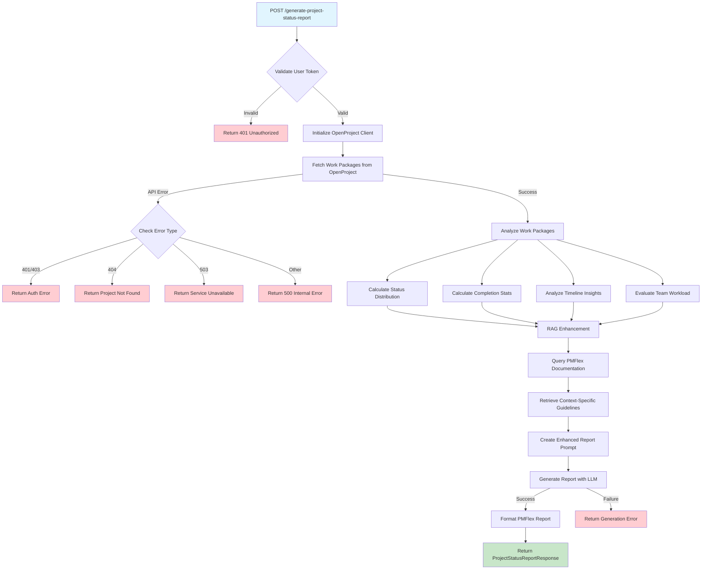
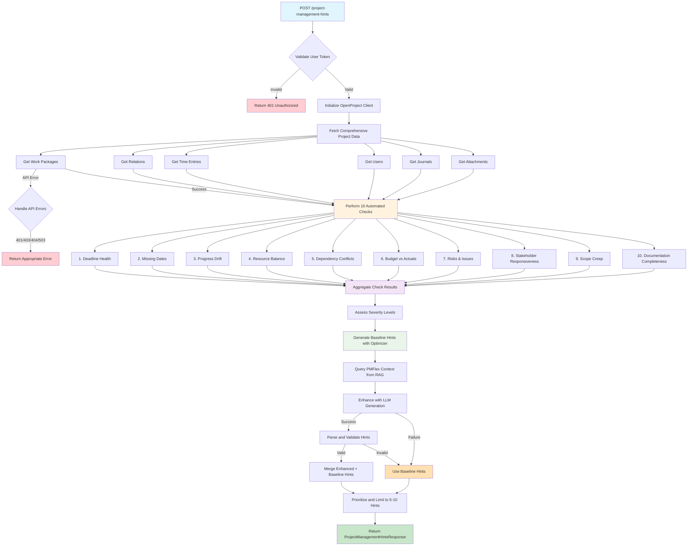

# OpenProject Haystack Workflow Diagrams and Summaries

## Table of Contents
1. [Generate Report Workflow](#generate-report-workflow)
2. [HintsAPI Workflow](#hintsapi-workflow)
3. [Workflow Diagrams](#workflow-diagrams)

---

## Generate Report Workflow

### Purpose
Generates comprehensive project status reports in German following PMFlex methodology standards for German federal government projects.

### Key Components
- **Endpoint**: `POST /generate-project-status-report`
- **Input**: Project ID, project type, OpenProject credentials
- **Output**: Structured German project status report with PMFlex-compliant sections

### High-Level Process Flow

#### 1. Authentication & Validation
- Validates user token presence
- Initializes OpenProject client with debug parameter
- Handles authentication errors (401/403)

#### 2. Data Collection
- Fetches all work packages for the project via OpenProject API
- Retrieves comprehensive work package data:
  - Status, priority, assignee information
  - Progress percentages (done_ratio)
  - Due dates and timeline data
  - Type classifications

#### 3. Analysis Phase
- **Status Distribution**: Categorizes work packages by status with detailed logging
- **Completion Statistics**: Calculates average completion, completed vs in-progress counts
- **Timeline Insights**: Identifies overdue items and upcoming deadlines
- **Team Workload**: Analyzes assignee distribution and individual workloads
- **Priority Analysis**: Evaluates priority distribution across work packages

#### 4. RAG Enhancement
- Queries PMFlex documentation for relevant project management guidelines
- Retrieves context-specific best practices based on project type
- Enhances report with German federal government standards

#### 5. Report Generation
- Uses LLM (Ollama) to create structured report with PMFlex template
- Generates comprehensive German report with sections:
  - **Zusammenfassung** (Executive Summary)
  - **Statusübersicht** (Status Overview with traffic light system)
  - **Abgeschlossene Aktivitäten** (Completed Activities)
  - **Nächste Aktivitäten** (Next Activities)
  - **Entscheidungsbedarf** (Decision Requirements)

### Error Handling
- **401 Unauthorized**: Invalid API key
- **403 Forbidden**: Insufficient permissions
- **404 Not Found**: Project not found
- **503 Service Unavailable**: OpenProject unavailable
- **500 Internal Error**: LLM generation failures

### Key Features
- PMFlex compliance for German federal projects
- Comprehensive work package analysis
- RAG-enhanced context from PMFlex documentation
- Professional German report formatting
- Detailed logging and error tracking

---

## HintsAPI Workflow

### Purpose
Provides actionable German project management hints based on automated health checks, helping project managers identify and address issues proactively.

### Key Components
- **Endpoint**: `POST /project-management-hints`
- **Input**: Project ID, project type, OpenProject credentials
- **Output**: List of prioritized, actionable hints in German (max 5-10)

### High-Level Process Flow

#### 1. Authentication & Validation
- Same authentication process as report workflow
- Validates user token and initializes OpenProject client

#### 2. Comprehensive Data Collection
- **Work Packages**: All project tasks with full metadata
- **Relations**: Dependencies and relationships between tasks
- **Time Entries**: Actual work logged against tasks
- **Users**: Team member information
- **Journals**: Activity history and communication logs
- **Attachments**: Documentation and file attachments

#### 3. 10 Automated Health Checks
Each check returns structured results with severity levels (ok/warning/critical):

1. **Deadline Health**: Identifies overdue and at-risk items
2. **Missing Dates**: Flags tasks without start/due dates
3. **Progress Drift**: Compares actual vs expected progress based on time elapsed
4. **Resource Balance**: Checks workload distribution and identifies overloaded users
5. **Dependency Conflicts**: Finds scheduling conflicts between related tasks
6. **Budget vs Actuals**: Compares estimated vs spent time
7. **Risks & Issues**: Highlights unaddressed problems and bugs
8. **Stakeholder Responsiveness**: Detects stale discussions (>7 days inactive)
9. **Scope Creep**: Monitors unexpected additions (new tasks in last 30 days)
10. **Documentation Completeness**: Ensures proper task documentation

#### 4. Severity Assessment & Prioritization
- Each check returns detailed findings with specific work package references
- Severity levels: critical (immediate action) > warning (short-term attention) > ok
- Aggregates results for overall project health assessment

#### 5. Hint Generation Process
- **Primary Path**: LLM generates context-aware hints based on check results
- **Fallback Path**: Hint optimizer creates rule-based hints if LLM fails
- **Enhancement**: Incorporates PMFlex context from RAG system
- **Prioritization**: Critical issues prioritized over warnings
- **Limitation**: Maximum 5-10 most important actionable hints

### Quality Assurance Features
- **JSON Validation**: Ensures proper hint structure
- **Fallback Mechanisms**: Multiple layers of reliability
- **Performance Metrics**: Tracks generation success rates
- **German Language**: Validates language and terminology
- **Hint Optimization**: Uses enhanced hint optimizer for better context-aware suggestions

### Error Handling
- Same API error handling as report workflow
- Additional LLM generation failure handling
- Automatic fallback to rule-based hint generation
- Performance monitoring and metrics tracking

---

## Workflow Diagrams

### Generate Report Workflow Diagram

### HintsAPI Workflow Diagram

### Key Differences Between Workflows

| Aspect | Generate Report | HintsAPI |
|--------|----------------|----------|
| **Data Scope** | Work packages only | Comprehensive project data |
| **Analysis Type** | Statistical analysis | Health checks + rule-based analysis |
| **Output Format** | Structured German report | Actionable hint list |
| **LLM Usage** | Primary generation path | Enhanced generation with fallback |
| **Error Handling** | Standard API errors | Enhanced with fallback mechanisms |
| **Performance** | Single analysis pass | Multiple parallel checks |
| **Complexity** | Medium | High |

### Technical Implementation Notes

#### Generate Report Workflow
- Uses `ProjectReportAnalyzer` for statistical analysis
- Implements PMFlex template with RAG enhancement
- Single-pass data processing for efficiency
- Comprehensive German report generation

#### HintsAPI Workflow
- Uses `ProjectManagementAnalyzer` for health checks
- Implements dual-path generation (LLM + fallback)
- Parallel processing of multiple data sources
- Enhanced reliability with hint optimizer
- Performance monitoring and metrics tracking

Both workflows follow the same authentication and error handling patterns but differ significantly in their analysis depth and output format.
